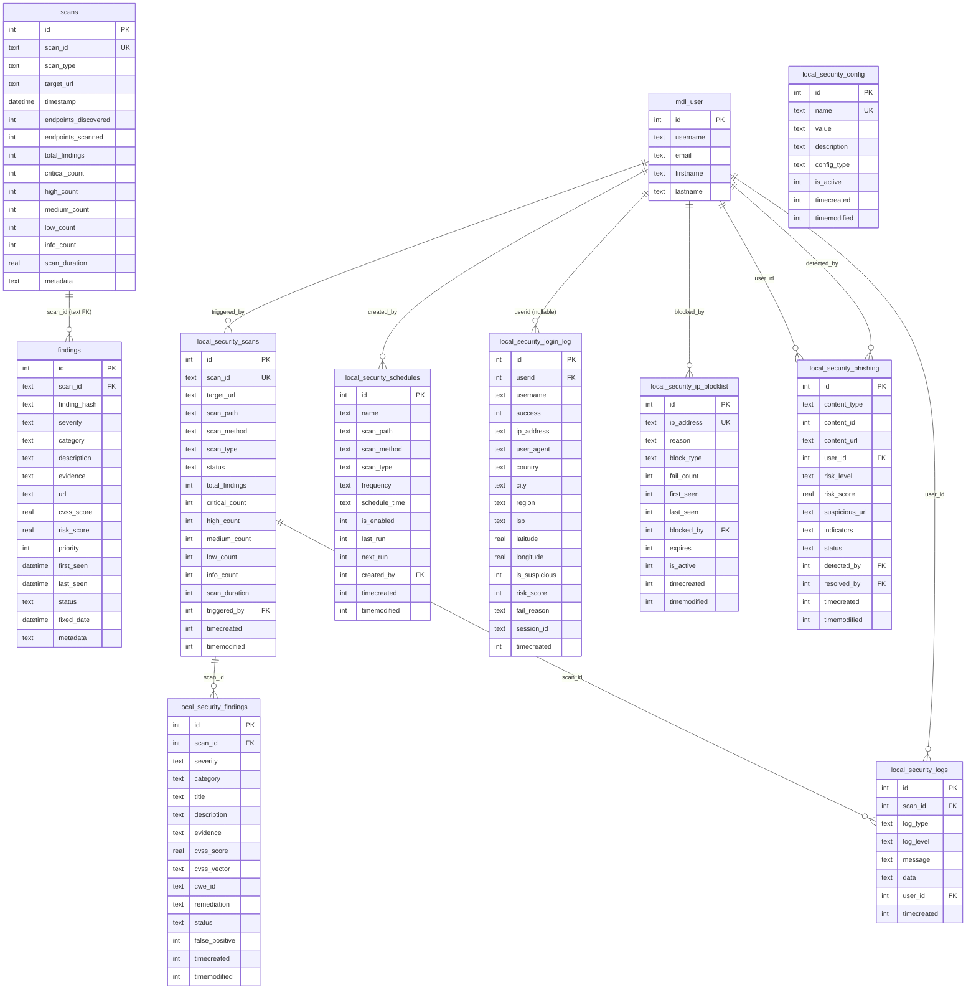
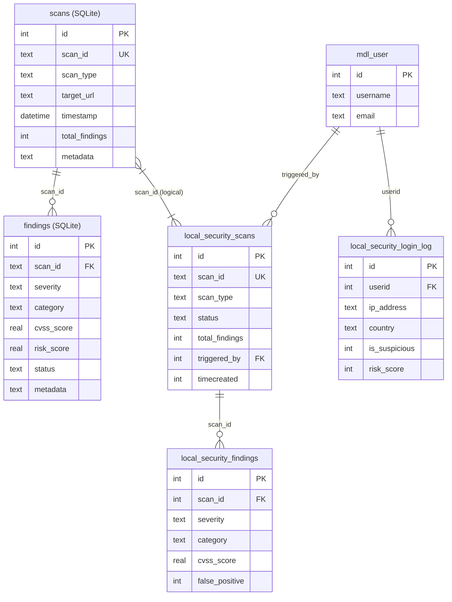

# ERD MoodleSec — Berdasarkan Kode Aktual

> Dibuat berdasarkan: `proxy/database/scan_history.py`, `moodle-plugin/db/install.xml`, `moodle-plugin/db/install_login_monitor.xml`
> Tidak di-push ke GitHub.

---

## ERD Lengkap (Mermaid)



---

## Catatan Arsitektur Penting

### Relasi Lintas Database (LOGIS, bukan FK fisik)

```
Proxy SQLite              Moodle MySQL/PostgreSQL
─────────────             ──────────────────────
scans.scan_id  ←──────────→  local_security_scans.scan_id
(text, UUID)   (logical      (text, UK index)
               matching,
               NO physical
               FK constraint)
```

> **Mengapa tidak ada FK fisik?**
> SQLite dan MySQL/PostgreSQL adalah dua database terpisah yang berjalan di proses berbeda.
> Foreign key constraint tidak bisa lintas database engine.
> Sinkronisasi dilakukan melalui API: Moodle plugin mengirim `scan_id` ke proxy,
> proxy menyimpan hasilnya dengan `scan_id` yang sama.

---

## ERD Ringkas untuk Paper (Fokus Entitas Utama)



---

## Tabel Ringkasan Entitas

| Entitas | Database | Tujuan | Baris Kunci |
|---------|----------|--------|-------------|
| `scans` | Proxy SQLite | Riwayat semua scan + statistik | `scan_id`, `metadata` (ml_stats) |
| `findings` | Proxy SQLite | Detail temuan per scan | `finding_hash` (deduplication), `metadata` (ml confidence) |
| `local_security_scans` | Moodle MySQL | Sinkronisasi scan ke Moodle | `scan_id`, `triggered_by` |
| `local_security_findings` | Moodle MySQL | Temuan yang ditampilkan di UI | `false_positive`, `cvss_score` |
| `local_security_logs` | Moodle MySQL | Audit trail aktivitas | `log_type`, `log_level` |
| `local_security_schedules` | Moodle MySQL | Jadwal scan otomatis | `frequency`, `next_run` |
| `local_security_login_log` | Moodle MySQL | Monitor login mencurigakan | `is_suspicious`, `risk_score`, `ip_address` |
| `local_security_ip_blocklist` | Moodle MySQL | Blokir IP berbahaya | `block_type`, `is_active` |
| `local_security_phishing` | Moodle MySQL | Deteksi konten phishing | `risk_level`, `suspicious_url` |
| `local_security_config` | Moodle MySQL | Konfigurasi plugin | `name` (UK), `config_type` |

*Dokumen ini tidak di-push ke GitHub. Dibuat: 2026-05-11*
